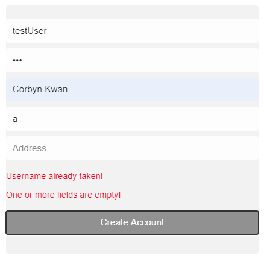
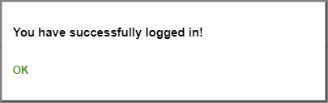
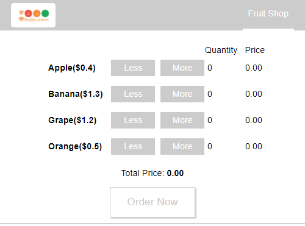
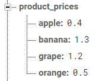
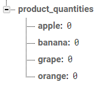

# Fruit Shop Website Coding Challenge

---

### Table of Contents

- [Description](#description)
- [Changes That Were Made](#changes-that-were-made)
- [How To Use](#how-to-use)

- [My Information](#My-Information)

---

## Description

A Fruit Shop Website done for the coding challenge. Users can create an account and buy fruits which sends it to the firebase server that stores their order.

You can [here](https://floating-dawn-11527.herokuapp.com/) to open the demo. 
#### Technologies

- React
- Firebase
- HTML5
- CSS
- Git

#### Classes I think are important

- LoginPage.js
- ProductPage.js
- LoginBox.js
- CreateAccountBox.js
- Products.js
- Product.js

[Back To The Top](#4Hour-Fruit-Shop-Website-Coding-Challenge)

---
## Changes That Were Made

- Supports multiple pages using the react-router package
- Users now have to input their address, and name. Updated database key/values to reflect this
- Added input checks when a user creates an account. 
- Made the price dynamically change in the Product Page
- Orders now syncs with the logged in account's information so that the user doesn't have to input their name/address everytime
- Updated certain parts of the codebase to load data from the server. 

---
## How To Use

### Opening the website
You can [here](https://floating-dawn-11527.herokuapp.com/) to open the demo. 

Or if you want to set it up locally:

Open the terminal and go to the project directory. Then you run in order:
#### `npm install`
Installs dependencies into the /node_modules directory. 

#### `npm start`

Runs the app in the development mode. 
Open [http://localhost:3000](http://localhost:3000) to view it in the browser. You should see a UI like this:

### Login Page

Here you have the option of Logging in using the test account. 

**Username**: **testUser**. \
**Password**: **testPass**. 

You also have the option of Creating an account by clicking the **Create Account** button. If you choose to make your own account you will see the following popup:   

Complete the form. If you make a mistake you will get error messages like the following: 

Once you complete the form, an account will be added to the database. Information on how to view the **database** can be viewed [here](#Viewing-the-Database)

Afterwards enter the **username** and **password** of your newly created account in the login form. This notification should appear:

Click Ok and you will be redirected to the **ProductPage**

### Product Page

The products will be loaded from the database. You can click **Less/More** on each product item to increase the quantity of the product(s) you want. The price will be dynamically updated as well.
 

Click **Order Now** for an order summary to be shown:

Click **CONTINUE** for your order to be processed and uploaded to the **database**. Information on how to view the **database** can be viewed [here](#Viewing-the-Database )

### Viewing the Database  
Click this [link](https://console.firebase.google.com/project/fruit-website/database/fruit-website/data) to view the database in the browser. You should see a UI like this:

You can click the **+** icon to view the fields of the keys. 

The following is an explations of what each key's purpose is:
#### `accounts`
Stores all the **accounts** created. 

#### `orders`
Stores all the **orders** created. Each order stores a **customer** which we get from their account, total **price**, and **products** quantities  

#### `product_prices`
Stores all the **prices of each product**

You can change the price of the products by **double clicking** on the value, **typing** the desired price, and **pressing** the enter key. **Refresh** the website and the changes will be reflected.

#### `products`
Stores the name of **products** that are being sold 

You can change the initial quantity of the products by **double clicking** on the value, **typing** the desired quantity, and **pressing** the enter key. **Refresh** the website and the changes will be reflected.

## My Information

 

[Back To The Top](#4Hour-Fruit-Shop-Website-Coding-Challenge)
